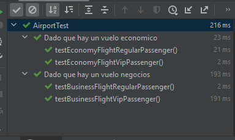

# PC2 DESARROLO DE SOFTWARE

## Pregunta 0
Este es el resultado de ejecución

Inicializamos los vuelos economicos y de negocio

Vemos que en el código se presenta que Cesar se declara como un pasajero VIP
mientras que Jessica se declara como una pasajera no VIP.

En las siguientes líneas del programa (siguiente imagen), primero agregamos
a Cesar en el vuelo de tipo Negocios y es agregado satisfactoriamente a este vuelo 
por ser un pasajero VIP (basado en el método addPassenger de la clase Flight), en la siguiente línea tratamos de remover a Cesar
del vuelo de Negocios pero al ser un vuelo de tipo Negocios nos retorna false directamente,
impidiendo que podamos removerlo (basado en el método removePassenger de la clase Flight). 

Luego tratamos de agregar a Jessica al vuelo de tipo Negocios, pero al no ser un 
pasajero VIP es rechazada (basado en el método removePassenger de la clase Flight) 
y no se agrega a este vuelo. En la siguiente línea agregamos a Jessica al vuelo de tipo 
Economico y es agregada satisfactoriamente (basado en el método addPassenger de la clase Flight)

Finalmente en las últimas líneas de la clase Airport imprimimos los pasajeros que hay en cada vuelo (siguiente imagen).

Y obtenemos el siguiente resultado.

## Pregunta 1

Ejecutamos  la prueba AirportTest  del directorio Fase1/Pruebas con la opción de coverage 
para poder ver a detalle hasta que punto y si se está usando el código que hemos realizado

Podemos observar que directamente al ejecutar el test no se alcanza a realizar
algún test en la clase main, ya que en esta clase no se ejecuta ninguna línea 
que se evalúe en el test, por tanto, su coverage es de 0%. En el Flight hay un
método que no se ejecuta, el cual vendría a ser getFlightType, así como tampoco se corren
las excepciones. Por lo que haría falta una revisión para que estas sean ejecutadas.

## Pregunta 2

Jhon realiza la refactorización para que sus pruebas cubran la mayor parte del código,
ya que en la fase actual los test no cubren el total del código de producción.

## Pregunta 2.5

Podemos apreciar que ahora las pruebas pueden cubrir absolutamente todos los
métodos del código de producción. Gracias a la refactorización ahora si es posible
evaluar por completo tanto los métodos de BusinessFlight y EconomyFlight, ya que
son clases extendidas de la clase Flight donde fueron declaradas como abstractas.

## Pregunta 3

Luego de refactorizar las pruebas

La cobertura del código es de un 100% para todas las clases

Sí, la refactorizacion usando TDD ayudó a mejorar la calidad del código haciendolo
más entendible

## Pregunta 4

Esta regla consiste en que si ves en tu proyecto tres fragmetos de código similares
es una señal de que debemos refactorizar. Y esto se relaciona con nuestro problema 
porque al hacer el tipo PremiumFlight notamos que el código seria similar al de
EconomyFlight y BusinessFlight.

## Pregunta 5

El diseño inicial de la clase PremiumFlight es el siguiente:

    public class PremiumFlight extends Flight {

        // Diseño inicial de la clase PremiumFlight. Pregunta 5
        public PremiumFlight(String id) {
            super(id);
        }
        @Override
        public boolean addPassenger(Passenger passenger){
            return false;
        }
    
        @Override
        public boolean removePassenger(Passenger passenger){
            return false;
        }
    }

## Pregunta 6

El código de prueba para el vuelo Premium será el siguiente

    @DisplayName("Dado que hay un vuelo Premium")
    @Nested
    class PremiumFlightTest{

        private Flight premiumFlight;
        private Passenger jessica;
        private Passenger cesar;

        @BeforeEach
        void setUp() {
            premiumFlight = new PremiumFlight("3");
            jessica = new Passenger("Jessica", false);
            cesar = new Passenger("Cesar", true);
        }

        @Nested
        @DisplayName("Cuando tenemos un pasajero VIP")
        class VipPassenger {
            @Test
            @DisplayName("El pasajero es agregado al vuelo premium")
            public void testPremiumFlightVipPassenger() {
                assertAll("Verifica todas las condiciones para un pasajero VIP y un vuelo premium",
                        () -> assertEquals(true, premiumFlight.addPassenger(cesar)),
                        () -> assertEquals(1, premiumFlight.getPassengersList().size()),
                        () -> assertEquals("Cesar", premiumFlight.getPassengersList().get(0).getName())
                );
            }
        }
        @Nested
        @DisplayName("Cuando tenemos un pasajero regular")
        class RegularPassenger {
            @Test
            @DisplayName("El pasajero es rechazado del vuelo premium")
            public void testPremiumFlightRegularPassenger() {
                assertAll("Verifica todas las condiciones para un pasajero regular y un vuelo premium",
                        () -> assertEquals(false, premiumFlight.addPassenger(jessica)),
                        () -> assertEquals(0, premiumFlight.getPassengersList().size())
                );
            }
        }
        @Nested
        @DisplayName("Cuando tenemos que remover un pasajero")
        class RemovePassenger {
            @Test
            @DisplayName("El pasajero sera removido del vuelo premium")
            public void testPremiumFlightRemovePassenger() {
                assertAll("Verifica todas las condiciones para remover un pasajero",
                        () -> assertEquals(true, premiumFlight.addPassenger(cesar)),
                        () -> assertEquals(1, premiumFlight.getPassengersList().size()),
                        () -> assertEquals(true, premiumFlight.removePassenger(cesar)),
                        () -> assertEquals(0, premiumFlight.getPassengersList().size())
                );
            }
        }
    }

Como es normal y estamos utilizando TDD algunas pruebas fallaran ya que aun no esta implementada
la lógica comercial del programa

## Pregunta 7
Es el código de la clase PremiumFlight con la lógica comercial implementada

    public class PremiumFlight extends Flight {
    
        // Diseño de la lógica comercial para los pasajeros VIP.Pregunta 7
        public PremiumFlight(String id) {
            super(id);
        }
        @Override
        public boolean addPassenger(Passenger passenger){
            return false;
        }
    
        @Override
        public boolean removePassenger(Passenger passenger){
            return false;
        }
    }

Ejecutamos las pruebas para el código anterior

## Pregunta 8

La prueba para que un pasajero sea agregado una sola vez sigue la siguiente
lógica:

    @DisplayName("Entonces no puedes agregarlo a un vuelo premium mas de una vez")
    @RepeatedTest(5)
    public void testPremiumFlightVipPassengerAddedOnlyOnce(RepetitionInfo repetitionInfo) {
        for (int i = 0; i < repetitionInfo.getCurrentRepetition(); i++) {
            premiumFlight.addPassenger(cesar);
        }
        assertAll("Verifica que un pasajero VIP se pueda agregar a un vuelo premium solo una vez",
                () -> assertEquals(1, premiumFlight.getPassengersSet().size()),
                () -> assertTrue(premiumFlight.getPassengersSet().contains(cesar)),
                () -> assertTrue(new ArrayList<>(premiumFlight.getPassengersSet()).get(0).getName().equals("Cesar"))
        );
    }

Lo mismo es para los vuelos económicos y de negocios luego cuando corremos las pruebas con cobertura
nos muestra el siguiente resultado.

Todas nuestras pruebas pasaron

Con una cobertura del 100%

